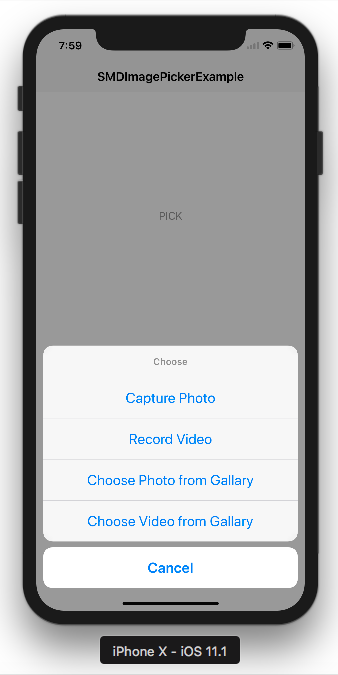

# SMDImagePicker


[](https://twitter.com/gajjartejas)
[](https://github.com/gajjartejas/SMDImagePicker/blob/master/README.md)
[](https://github.com/gajjartejas/SMDImagePicker)
[](http://cocoadocs.org/docsets/SMDImagePicker/)

A Clouser based UIImagePickerController wrapper in Swift.
***

[](Screenshots/1.png)

## Demo

Do `pod try SMDImagePicker` in your console and run the project to try a demo.
To install [CocoaPods](http://www.cocoapods.org), run `sudo gem install cocoapods` in your console.

## Installation 📱

This branch supports Swift 4.

### CocoaPods

Use [CocoaPods](http://www.cocoapods.org).

1. Add `pod 'SMDImagePicker'` to your *Podfile*.
2. Install the pod(s) by running `pod install`.
3. Add `import SMDImagePicker` in the .swift files where you want to use it

### Source files

A regular way to use SMDImagePicker in your project would be using Embedded Framework. There are two approaches, using source code.

Add source code:

1. Download the [latest code version](https://github.com/gajjartejas/SMDImagePicker/archive/master.zip).
2. Unzip the download file, copy `SMDImagePicker` folder to your project folder

After you get the source code either by adding it directly or using submodule, then do the following steps:

- Open `SMDImagePicker` folder, and drag `SMDImagePicker.xcodeproj` into the file navigator of your app project, under you app project.
- In Xcode, navigate to the target configuration window by clicking the blue project icon, and selecting the application target under the "Targets" heading in the sidebar.
- Open "Build Phases" panel in the tab bar at the top of the window, expend the "Target Dependencies" group and add `SMDImagePicker.framework` under SMDImagePicker icon in the popup window by clicking `+`. Similarly, you can also add `SMDImagePicker.framework` in "Embedded Binaries" under "General" tab.

## Basic usage ✨

```swift
import SMDImagePicker
import MobileCoreServices

let imagePicker = SMDImagePicker()

//For Gallary Images
//Optional
let photoGallaryOptions = SMDImagePicker.PhotoGallaryOptions(allowsEditing: true,
                                                             mediaTypes: [kUTTypeImage as String])
imagePicker.configure(photoGallaryOptions)
imagePicker.choose(media: .choosePhoto, presentFrom: self) { (media, status) in
    if status == .success {
        //You will get media?.editedImage or media?.originalImage if cropping is disabled.
    } else {
        //See example for error handling
}

//For Image Capture From Camera 
//Optional
let options =  SMDImagePicker.PhotoCaptureOptions(allowsEditing: true,
                                                  cameraDevice: .rear,
                                                  mediaTypes: [kUTTypeImage as String],
                                                  flashMode: .auto)
imagePicker.configure(options)
imagePicker.capture(media: .takePhoto, presentFrom: self) { (media, status) in
    if status == .success {
        //You will get media?.editedImage or media?.originalImage if cropping is disabled.
    } else {
        //See example for error handling
    }
}

//For Gallary Video
//Optional
let options = SMDImagePicker.VideoGallaryOptions(allowsEditing: false,
                                                             mediaTypes: [kUTTypeMovie as String],
                                                             maximumDuration: 2*60, //Duration 2 Minutes
                                                             quality: UIImagePickerControllerQualityType.typeMedium)
imagePicker.configure(photoGallaryOptions)
imagePicker.choose(media: .chooseVideo, presentFrom: self) { (media, status) in
    if status == .success {
        //Here you will get media?.mediaURL for video
        //For Video thumb image?.videoThumb
    } else {
        //See example for error handling
    }

//For Record Video
let options = SMDImagePicker.PhotoCaptureOptions(allowsEditing: true,
                                                 cameraDevice: .rear,
                                                 mediaTypes: [kUTTypeMovie as String],
                                                 flashMode: .auto)
imagePicker.configure(options)
imagePicker.capture(media: .takeVideo, presentFrom: self) { (media, status) in
    if status == .success {
        //Here you will get media?.mediaURL for video
        //For Video thumb image?.videoThumb
    } else {
       //See example for error handling
    }
